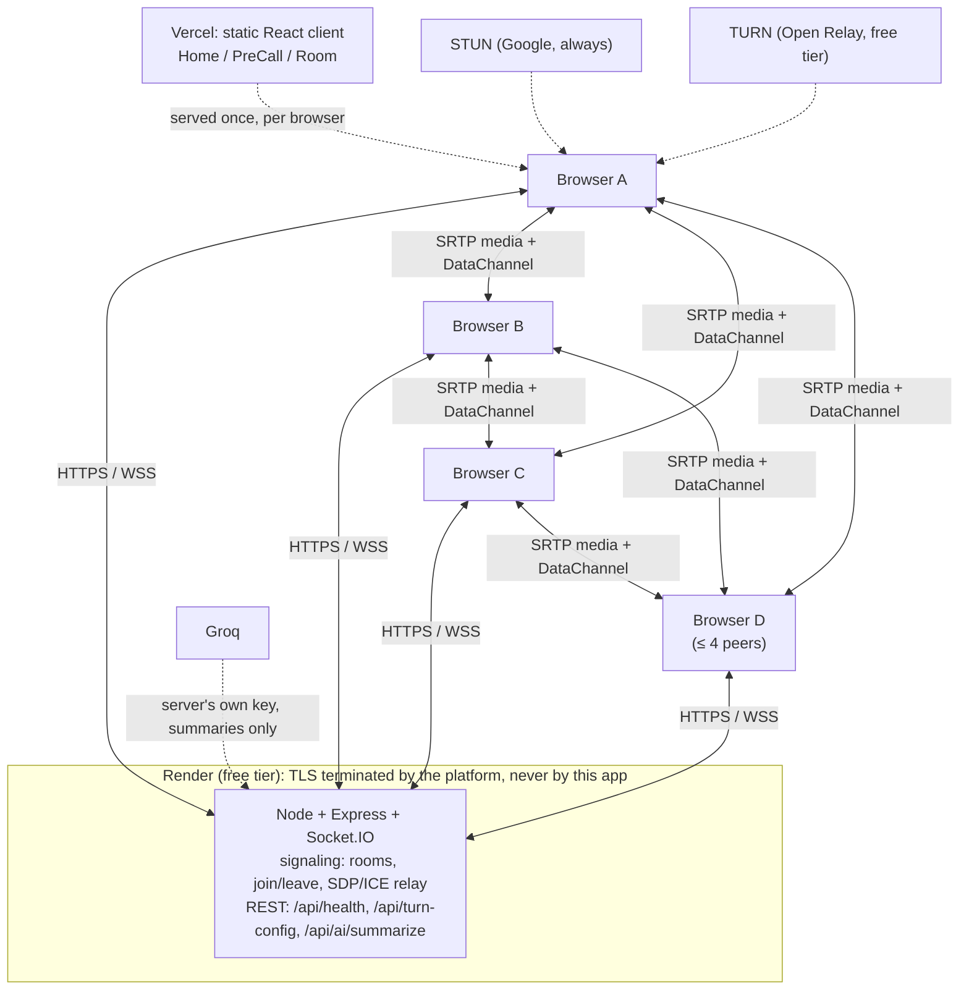

# Patchbay

**Free, peer-to-peer video meetings with nobody in between.** Screen sharing, live
captions, background blur, file transfer, and AI-generated meeting summaries: no
account, no server relaying your media, no cost to run. TypeScript end to end.

[](https://github.com/Sujan-6905/Patchbay/actions/workflows/ci.yml)
[](https://github.com/Sujan-6905/Patchbay/actions/workflows/ci.yml)
[](#tech-stack)
[](./LICENSE)

**Live demo:** _deploying. Link will be added here once it's live. In the meantime,
see [Getting started](#getting-started) to run it in under a minute, or
[Deployment](#deployment) to put your own copy online for free._

## Why "Patchbay"

A patchbay is the panel in a recording studio where an engineer joins two lines with
one cable, no switchboard, no signal passing through a rack in between. That's the
architecture here: once a call connects, video, audio, chat, and files travel directly
between browsers over WebRTC. The server's only job is introducing two peers to each
other; it never sees a frame of video or a byte of a file transfer.

## Features

- **Group video calls**, peer-to-peer mesh, up to 4 participants (the math behind that
  cap is in [Engineering highlights](#engineering-highlights))
- **Screen sharing** as a second, independent video track: camera and screen shown
  separately, fullscreen either one
- **In-call chat, emoji reactions, and file transfer** (up to 50 MB) over WebRTC
  DataChannels, peer-to-peer; the signaling server never sees any of it
- **Live captions** (on-device, Web Speech API) and **background blur** (on-device,
  MediaPipe): free, private, no API key
- **AI meeting summaries**, included free: one click turns the call's transcript into a
  markdown summary with decisions and action items, powered by a server-held Groq key
  so no visitor ever needs their own account or key
- **Meeting recording**, entirely client-side: composites every visible tile and
  everyone's audio into one file (MP4 where the browser supports it, WebM otherwise),
  downloads straight to your device; nothing is ever uploaded
- **A live connection-quality dashboard**: per-peer bitrate, RTT, jitter, packet loss,
  codec, and whether the call fell back to a TURN relay
- Device selection and video/audio quality presets, hot-swappable mid-call

## Tech stack

| Layer          | Technology                                                                 |
| -------------- | --------------------------------------------------------------------------- |
| Client         | React 18, TypeScript, Vite, Tailwind CSS, Zustand, Motion (Framer Motion) |
| Real-time      | WebRTC (`RTCPeerConnection`, DataChannels), Socket.IO                     |
| On-device AI   | MediaPipe (`@mediapipe/tasks-vision`), Web Speech API                      |
| Server         | Node.js, Express, Socket.IO, Zod, Helmet                                  |
| AI summaries   | Groq (Llama 3.3 70B), server-proxied, key never reaches the client        |
| Shared         | A typed signaling protocol + Zod schemas, imported by client and server   |
| Testing        | Vitest (82 unit tests), Playwright (17 end-to-end scenarios)              |
| CI/CD          | GitHub Actions (lint, typecheck, unit + e2e tests, Docker build)          |
| Infra          | Docker (multi-stage build) on Render (API + signaling); static build on Vercel (frontend) |

## Architecture



The server relays signaling (who's in a room, SDP offers/answers, ICE candidates) and
proxies the one AI request; it never touches media, chat, or files. Full protocol
details, including offer/answer glare handling, are in
[`docs/SIGNALING.md`](./docs/SIGNALING.md).

### Project structure

```
client/             React + TypeScript UI (Home, PreCall, Room, PeerManager)
server/             Express + Socket.IO signaling server (RoomStore, REST API)
shared/             Typed signaling protocol + Zod validation schemas, used by both sides
e2e/                Playwright end-to-end tests
docs/               Protocol, privacy, and deployment documentation
Dockerfile          Multi-stage build: shared + server + client -> one slim runtime image
docker-compose.yml  One-command self-hosting
render.yaml         Render deployment blueprint (backend)
vercel.json         Vercel deployment config (frontend)
```

## Getting started

**Prerequisites:** Node.js 20+ and npm.

```bash
git clone https://github.com/Sujan-6905/Patchbay.git patchbay
cd patchbay
npm install
npm run dev
```

Open `http://localhost:5173` in a couple of browser tabs; `localhost` is a secure
context, so camera/mic permissions work without any certificate setup. Create a room
in one tab, join with the code (or the shared link) in the others.

AI meeting summaries are optional: without a key, everything else works and that one
feature is simply disabled. To enable it, put a free key from
[console.groq.com/keys](https://console.groq.com/keys) in `server/.env`:

```bash
cp server/.env.example server/.env
# then edit server/.env and set GROQ_API_KEY
```

Prefer Docker? `docker compose up --build` builds and serves the whole app (client +
server, one container) on `http://localhost:5001`.

## Usage guide

- **Start a call** from the home page, pick a display name, and share the room link or
  6-character code with up to 3 other people.
- **Controls** (bottom bar): mute/unmute, camera on/off, screen share, chat, reactions,
  live captions, background blur, connection stats, and recording.
- **Chat panel** also holds file transfer and **Summarize meeting**: available once
  someone has spoken, it sends the call's transcript once to generate a summary.
- **Settings** (gear icon): swap camera/microphone mid-call, or adjust video/audio
  quality if your connection is constrained.

## Deployment

The recommended setup splits hosting in two: the static frontend on **Vercel**
([`vercel.json`](./vercel.json)) and the signaling/API server on **Render**
([`render.yaml`](./render.yaml), a ready-to-use Blueprint). Only the backend is a stateful
Node process, so only it pays Render's free-tier cold-start cost; the frontend loads
instantly from Vercel's edge network regardless.

1. Push this repo to your own GitHub account.
2. Deploy the backend first: in the [Render dashboard](https://dashboard.render.com),
   **New → Blueprint**, point it at your fork. Note the assigned URL
   (`https://<name>.onrender.com`).
3. Deploy the frontend: in the [Vercel dashboard](https://vercel.com/new), import the
   same repo and set `VITE_API_BASE_URL` to the Render URL from step 2 before the first
   deploy.
4. Back in Render, set `CORS_ORIGIN` to the Vercel URL you were assigned.
5. Optional: set `GROQ_API_KEY` (free, from [console.groq.com/keys](https://console.groq.com/keys))
   to enable AI meeting summaries; set `TURN_URLS`/`TURN_USERNAME`/`TURN_CREDENTIAL`
   (free from [Open Relay Project](https://www.metered.ca/tools/openrelay/)) if you want
   calls to work behind symmetric NAT.
6. Every push to `main` redeploys both services automatically.

**Cold starts:** Render's free plan spins the backend down after about 15 minutes of no
traffic; waking it back up can take up to a minute or two. Rather than let a visitor hit
that delay mid-action, the frontend pings the backend the moment the home page loads and
shows a live status pill while it wakes up; starting or joining a call stays disabled
(with an explanation) until the connection is actually ready. Full walkthrough of this
path plus a single-container Render-only alternative and a Cloudflare Tunnel alternative
for self-hosting anywhere, in [`docs/DEPLOYMENT.md`](./docs/DEPLOYMENT.md).

## Scripts

Run from the repo root (npm workspaces):

| Command              | What it does                                                       |
| -------------------- | -------------------------------------------------------------------- |
| `npm run dev`        | Server + client, both with hot reload                              |
| `npm run build`      | Builds `shared`, `server`, then `client`                           |
| `npm test`           | Unit tests (Vitest) for `shared`, `server`, and `client`            |
| `npm run test:e2e`   | Playwright end-to-end tests (fake-media browser contexts)           |
| `npm run lint`       | ESLint across the whole repo                                       |
| `npm run typecheck`  | `tsc --noEmit` for every workspace                                  |
| `docker compose up`  | Full app in one container, `http://localhost:5001`                 |

## Engineering highlights

- **Perfect negotiation & glare.** Every connection has a fixed polite/impolite role,
  decided once by join order. When both sides' `onnegotiationneeded` fire close
  together (e.g. a third participant joining renegotiates an existing pair while a
  device switch is also renegotiating it), the impolite peer drops a colliding remote
  offer; the polite peer lets `setRemoteDescription()` implicitly roll back its own
  pending offer. No server coordination, no races. See `client/src/lib/PeerManager.ts`.
- **Trickle ICE, no server-side storage.** Candidates are relayed the moment they're
  generated and queued client-side until `setRemoteDescription` has run; the signaling
  server never stores an SDP or a candidate, only room membership.
- **Mesh vs. SFU, with the actual math.** A P2P mesh needs `n·(n-1)/2` connections, and
  each client uploads `n-1` copies of its own stream. At the chosen cap of 4: 6
  connections total, 3 uploads per client: reasonable on a home connection. At 8
  participants that's 28 connections and 7 uploads each; consumer upload bandwidth
  collapses well before the server would even notice. That's the point an SFU
  (mediasoup, LiveKit) becomes worth its added complexity and server bandwidth cost,
  not implemented here on purpose (see [Limitations](#limitations--whats-next)).
- **STUN always, TURN as a fallback.** `GET /api/turn-config` assembles ICE servers
  from environment variables server-side; clients never hardcode them. The connection
  dashboard's candidate-pair-type badge is how you'd verify a call actually used TURN.
- **DataChannel backpressure.** File transfer chunks at 16 KB over a `negotiated`
  (fixed-id) `RTCDataChannel`, gated by `bufferedAmountLowThreshold`; a naive `send()`
  loop without this silently crashes the channel on anything but tiny files.
- **AI summaries without a BYOK dance.** A single server-held Groq key
  (`GROQ_API_KEY`) makes summaries free for every visitor. The key never reaches the
  browser, and the transcript leaves a participant's machine only at the moment they
  click Summarize (`server/src/api/ai.ts`; see [`docs/PRIVACY.md`](./docs/PRIVACY.md)).
- **The connection-quality dashboard.** Polls `RTCPeerConnection.getStats()` every 2s
  per peer, deriving bitrate from cumulative byte counters and reading RTT/jitter/loss/
  codec/candidate-pair-type off the nominated transport. `client/src/lib/parseStatsReport.ts`
  is unit-tested against synthetic `RTCStatsReport`s, so the parsing logic is verified
  without needing a live call.
- **Reliable client-side recording.** `client/src/lib/meetingRecorder.ts` composites
  every currently-visible tile and mixes every peer's audio through a Web Audio
  `MediaStreamAudioDestinationNode`, driven by a Worker-based clock (not
  `requestAnimationFrame`, which stalls in a hidden or minimized tab). It prefers MP4
  (H.264/AAC) for universal player compatibility, patches WebM's missing duration
  metadata when that's the fallback, and decodes the finished file before handing it
  back, so a broken recording is caught and never silently downloaded.

## Privacy & security

- [`docs/SIGNALING.md`](./docs/SIGNALING.md): protocol spec + mermaid sequence diagrams
  (join, offer/answer glare rollback, peer-left, ICE restart).
- [`docs/PRIVACY.md`](./docs/PRIVACY.md): exactly what leaves your machine, and when,
  for captions, background blur, and AI summaries.
- [`docs/DEPLOYMENT.md`](./docs/DEPLOYMENT.md): full Render + Cloudflare Tunnel
  deployment paths, and why WebRTC requires HTTPS in the first place.
- Production hardening: Helmet, `trust proxy` (so per-IP rate limiting sees the real
  client behind a reverse proxy), a capped Socket.IO payload size, and per-IP rate
  limits on both room creation and the AI proxy.

## Limitations & what's next

Being upfront about the edges, because pretending they don't exist is worse than naming them:

- **No SFU.** The mesh cap of 4 is a deliberate trade-off (see the math above), not a
  temporary limitation, but it does mean this can't become a 20-person meeting app
  without a real architecture change (mediasoup or LiveKit, most likely, with the mesh
  path kept for small calls).
- **In-memory `RoomStore`, single instance only.** Room membership lives in a plain
  `Map` intentionally, since Redis would be unjustified complexity at this scale (see
  `server/src/rooms/RoomStore.ts`). It means this can't horizontally scale past one
  server instance without a Redis-backed (or similar) store swapped in behind the same
  interface.
- **No end-to-end encryption beyond standard SRTP.** Media is encrypted hop-by-hop like
  any WebRTC call, so a TURN relay (when one is in the path) can see plaintext media
  metadata, if not content. The WebRTC Insertable Streams API would let a symmetric key
  (exchanged over the existing DataChannel, never through the server) encrypt frames
  before they reach the RTP layer (real engineering effort, not yet built).
- **Client bundle is a few hundred KB gzipped**, mostly `@mediapipe/tasks-vision`,
  `react-markdown`, and `motion`. The first two are only needed once a user actually
  toggles blur or requests a summary; dynamic `import()`-ing them on first use instead
  of bundling them upfront would be the straightforward fix.

## License

MIT, see [`LICENSE`](./LICENSE).
