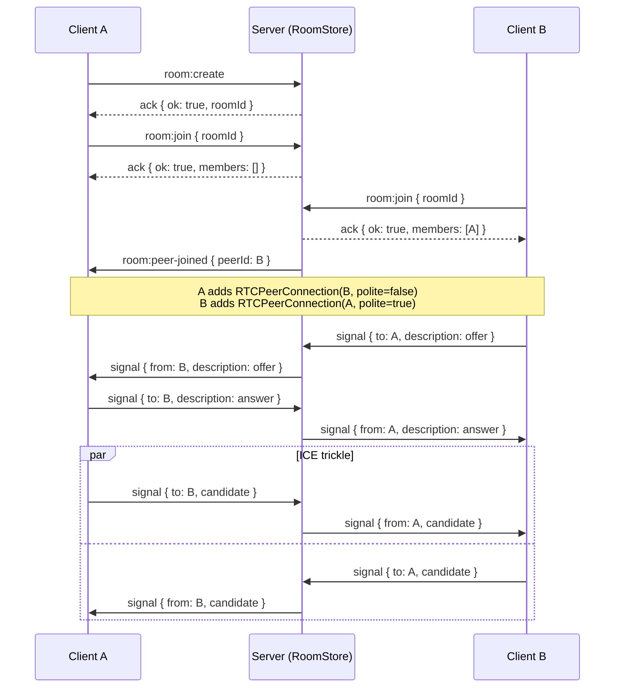
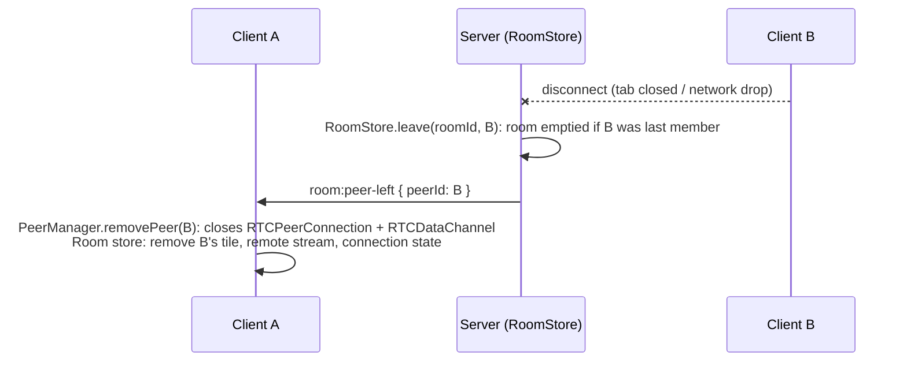

# Signaling protocol

The server is a pure relay: it stores only room membership, never SDP or ICE candidates.
Storing only the latest candidate per side was a structural bug in an earlier version of
this app (real sessions generate many candidates over a connection's lifetime, and
overwriting them broke reconnection). All payloads are typed in `shared/src/types.ts` and
validated server-side with the zod schemas in `shared/src/schemas.ts`.

## Events

| Event               | Direction       | Payload                                             | Ack                                             |
| ------------------- | --------------- | --------------------------------------------------- | ----------------------------------------------- |
| `room:create`       | client → server | -                                                   | `{ ok: true, roomId } \| { ok: false, error }`  |
| `room:join`         | client → server | `{ roomId, displayName }`                           | `{ ok: true, members } \| { ok: false, error }` |
| `room:leave`        | client → server | -                                                   | -                                               |
| `room:peer-joined`  | server → client | `{ peerId, displayName }`                           | -                                               |
| `room:peer-left`    | server → client | `{ peerId, displayName }`                           | -                                               |
| `member:state`      | client → server | `{ micEnabled, camEnabled, sharingScreen }`         | -                                               |
| `room:member-state` | server → client | `{ peerId, micEnabled, camEnabled, sharingScreen }` | - (fanned out to the room, not the sender)      |
| `signal`            | client ↔ server | `{ to, description? , candidate? }`                 | - (server injects `from` and relays verbatim)   |

`member:state` is broadcast whenever mic/camera/screen-share toggles, and proactively resent
on `room:peer-joined` so newcomers (and everyone else) get an accurate picture; the server
never tracks this state itself, it's a pure relay same as `signal`.

Room capacity is capped at 4 members (`MAX_ROOM_MEMBERS`), mesh's practical ceiling, since
each client uploads n−1 streams. `GET /api/rooms/:roomId/status` gives the pre-call screen a
best-effort pre-join capacity check (`{ exists, memberCount, full }`); `room:join`'s ack
remains the authoritative check since a room can fill up in between.

`room:create` is also per-IP rate-limited (`RoomErrorCode: 'RATE_LIMITED'`,
`server/src/rateLimiter.ts`), a from-scratch sliding-window limiter, since `express-rate-limit`
only applies to the REST routes, not Socket.IO events.

Room IDs are 6-character codes from a custom nanoid alphabet (no ambiguous characters),
chosen for readability when read aloud on a call; see `shared/src/ids.ts`.

## Join flow

1. Client A calls `room:create`, gets back `roomId`, and navigates to `/room/:roomId`.
2. Client A calls `room:join({ roomId })`. The room is empty, so the ack returns
   `{ ok: true, members: [] }`. Client A is now a member.
3. Client B opens the same room URL and calls `room:join({ roomId })`. The ack returns
   `{ ok: true, members: [{ peerId: A }] }`. The server also emits `room:peer-joined({ peerId: B })`
   to A.
4. Because B received A's id in its own join ack, **B is the "newcomer" relative to A** and
   is the polite peer on that connection. A, having learned about B via `room:peer-joined`,
   is impolite on the same connection. This mapping is what `PeerManager.addPeer(peerId, polite)`
   encodes; see `client/src/lib/PeerManager.ts`.

## Perfect negotiation (offer/answer + glare)

Both peers add local tracks to a fresh `RTCPeerConnection` when a peer is added, so both
sides' `onnegotiationneeded` can fire close together, an "offer collision" (glare). Perfect
negotiation resolves this deterministically without any server coordination:

- The **impolite** peer, on receiving a colliding offer, ignores it (its own offer wins).
- The **polite** peer, on receiving a colliding offer, just calls `setRemoteDescription()`:
  browsers roll back the peer's own pending local offer _implicitly_ when a remote offer
  arrives while `signalingState` is `"have-local-offer"`. An earlier version of this code
  paired that with an explicit, concurrent `setLocalDescription({type: 'rollback'})` (an older
  pattern seen in some perfect-negotiation write-ups); racing it against the polite peer's own
  still-pending initial `setLocalDescription()` call could leave that promise permanently
  unresolved once a third participant's connections were negotiating close together; removed
  in favor of relying on the implicit rollback alone.

ICE candidates that arrive before `setRemoteDescription` has resolved are queued per-peer
client-side and flushed immediately after (see `PeerManager.pendingCandidates`): trickle
ICE, with no candidate ever stored server-side.

## DataChannel (chat, reactions, file transfer)

Each `RTCPeerConnection` also opens a `negotiated` (fixed `id: 0`) `RTCDataChannel`; both
sides declare it upfront via `createDataChannel(label, { negotiated: true, id })` instead of
one side calling it and the other listening for `ondatachannel`, so it's usable as soon as the
underlying SCTP association is up, with no separate renegotiation round of its own.

Messages are typed JSON text frames (`shared/src/types.ts`'s `DataChannelMessage` union: `chat`,
`reaction`, `file-meta`, `file-done`) validated on receipt with `dataChannelMessageSchema`; file
bytes are sent as raw binary frames (`channel.binaryType = 'arraybuffer'`) between the
`file-meta` and `file-done` messages, chunked at 16 KB with `bufferedAmountLowThreshold`-based
backpressure. None of this touches the server; a mesh call's chat and file transfers work even
if the signaling server goes down mid-call, as long as the peer connections are already up.

Every connection a `PeerManager` opens shares one DTLS certificate
(`RTCPeerConnection.generateCertificate()`, generated once in `Room.tsx` before the first
`addPeer` call and passed via the `certificates` constructor option) rather than each connection
generating its own; otherwise a third participant's join can leave one of the two new
connections' offer creation pending for tens of seconds while Chromium generates certificates
one at a time.

## Disconnect / cleanup

On `disconnect` (tab close, network drop, or explicit `room:leave`), the server removes the
socket from its `RoomStore` room, broadcasts `room:peer-left` to the remaining members, and
deletes the room once it's empty. A TTL sweep also removes rooms that were created but never
joined (e.g. the creator closed the tab before anyone joined).

## Mermaid diagram (join + first offer)



## Mermaid diagram (offer/answer glare + implicit rollback)

Glare happens when both peers' `onnegotiationneeded` fires close together, e.g. a third
participant joining triggers fresh negotiation on an existing pair's connection while a device
switch or bitrate change is also renegotiating it. Per the join flow above, exactly one side of
any given connection is polite and the other impolite; that role, decided once at connection
creation, is what breaks the tie:

```mermaid
sequenceDiagram
    participant A as Client A (impolite)
    participant S as Server (relay)
    participant B as Client B (polite)

    Note over A,B: Both sides' onnegotiationneeded fires around the same time

    A->>A: makingOffer = true<br/>setLocalDescription(offer)
    B->>B: makingOffer = true<br/>setLocalDescription(offer)

    A->>S: signal { to: B, description: offer }
    S->>B: signal { from: A, description: offer }
    B->>S: signal { to: A, description: offer }
    S->>A: signal { from: B, description: offer }

    Note over A: Impolite + offer collision (signalingState !== stable)<br/>→ ignoreOffer = true → B's offer is dropped, no response sent
    Note over B: Polite + offer collision<br/>→ setRemoteDescription(A's offer) implicitly rolls back B's own pending offer

    B->>B: setLocalDescription(answer)
    B->>S: signal { to: A, description: answer }
    S->>A: signal { from: B, description: answer }

    Note over A,B: A's offer won; B's competing offer was silently discarded, no server involvement in resolving the collision
```

## Mermaid diagram (peer-left)

Triggered by an explicit `room:leave`, a tab close, or a dropped connection (both reach the
same server-side path via `socket.on('disconnect')`):



## Mermaid diagram (ICE restart)

`onconnectionstatechange` firing `"failed"` (e.g. a network change breaks all candidate pairs)
triggers a restart, reusing the same perfect-negotiation path, not a special case:

```mermaid
sequenceDiagram
    participant A as Client A
    participant S as Server (relay)
    participant B as Client B

    Note over A: pc.onconnectionstatechange → "failed"
    A->>A: pc.restartIce()
    Note over A: Flags the next offer as an ICE restart<br/>triggers onnegotiationneeded like any other renegotiation

    A->>S: signal { to: B, description: offer (ICE restart) }
    S->>B: signal { from: A, description: offer }
    B->>S: signal { to: A, description: answer }
    S->>A: signal { from: B, description: answer }

    par Fresh ICE trickle
        A->>S: signal { to: B, candidate }
        S->>B: signal { from: A, candidate }
    and
        B->>S: signal { to: A, candidate }
        S->>A: signal { from: B, candidate }
    end

    Note over A,B: pc.onconnectionstatechange → "connected"; VideoTile's "reconnecting..." overlay clears
```
